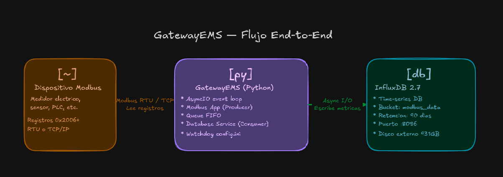
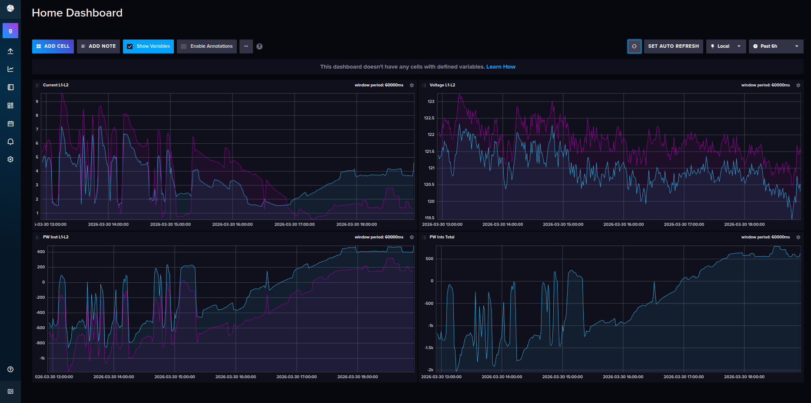
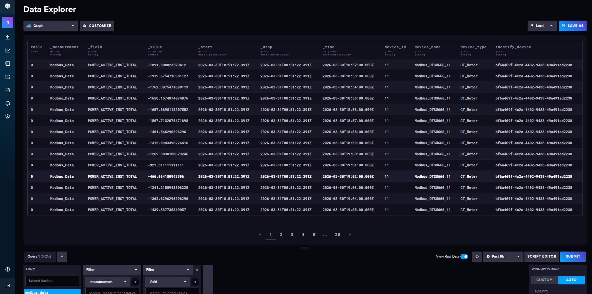
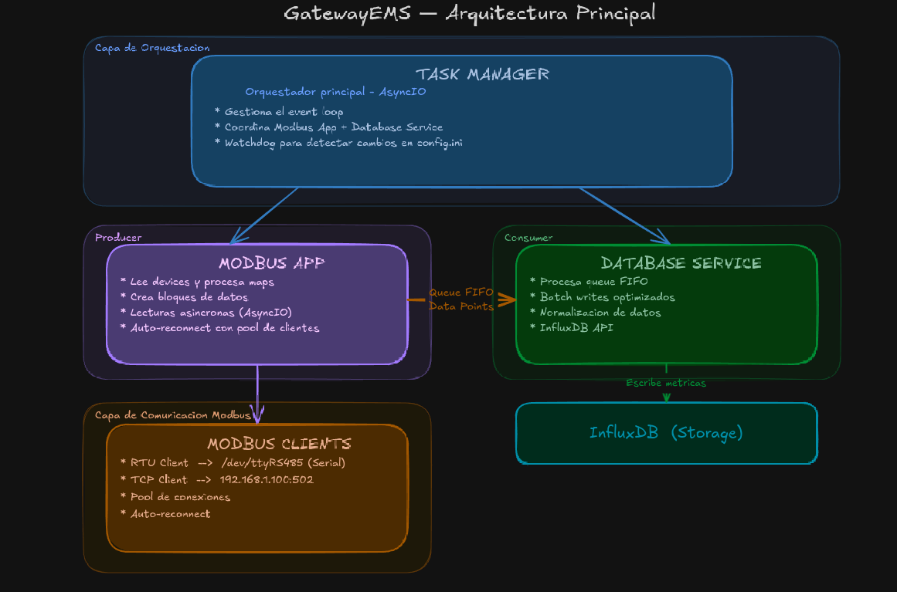

<div align="center">

# ⚡ GatewayEMS

### Sistema de Adquisición de Datos Modbus a InfluxDB

[](https://www.python.org/downloads/)
[](htmlcov/index.html)
[](tests/)
[](LICENSE)

**Gateway profesional para lectura de dispositivos Modbus RTU/TCP y almacenamiento en InfluxDB con arquitectura asíncrona.**

</div>

---

## 📋 Contenido

1. [¿Qué es GatewayEMS?](#-qué-es-gatewayems)
2. [Arquitectura del Sistema](#-arquitectura-del-sistema)
3. [Configuración](#-configuración)
4. [Instalación y Ejecución](#-instalación-y-ejecución)

---

## 🎯 ¿Qué es GatewayEMS?

**GatewayEMS** es un sistema de adquisición de datos industrial que lee información de dispositivos Modbus (medidores de energía, sensores, PLCs) y la almacena en una base de datos de series temporales **InfluxDB** para análisis, visualización y monitoreo en tiempo real.

### ¿Qué hace?

<div align="center">



</div>

### Características principales

✅ **Modbus RTU y TCP** - Soporta comunicación serial (RS485) y Ethernet  
✅ **Lectura optimizada** - Modo `blockreading` para agrupar registros contiguos  
✅ **Asíncrono (AsyncIO)** - Maneja múltiples dispositivos en paralelo sin bloqueos  
✅ **InfluxDB 2.x** - Base de datos optimizada para métricas con timestamps  
✅ **Configuración flexible** - `.ini` para dispositivos, `.json` para mapas Modbus, `.env` para credenciales  
✅ **Docker ready** - `docker-compose.yml` incluido para despliegue rápido  
✅ **Reconexión automática** - Manejo robusto de errores y pérdida de conexión  
✅ **Clean Architecture** - Código mantenible con separación de responsabilidades  

### Casos de uso

- 📊 Monitoreo de consumo eléctrico en plantas industriales
- 🏭 Adquisición de datos de sensores en tiempo real
- ⚡ Análisis de calidad de energía (voltaje, corriente, potencia)
- 📈 Dashboards de métricas con Grafana + InfluxDB
- 🔌 Integración de dispositivos Modbus legacy a sistemas modernos

### Datos en tiempo real

El sistema lee variables como voltaje, corriente, potencia y energía, y las almacena con timestamps para visualización histórica:

<div align="center">


*Ejemplo de lectura de registros Modbus desde el dispositivo*


*Datos almacenados en InfluxDB listos para consultar*

</div>

---

## 🏗️ Arquitectura del Sistema

GatewayEMS implementa **Clean Architecture** con separación en capas y patrón **Producer-Consumer** para desacoplar lectura de almacenamiento.

### Diagrama de componentes

<div align="center">



</div>

### Flujo de datos

1. **Task Manager** inicia el event loop y coordina componentes
2. **Modbus App** lee `config.ini` y carga mapas JSON de cada dispositivo
3. **Modbus Clients** se conectan vía RTU o TCP según configuración
4. **Block Reading**:
   - Si `blockreading=true`: Agrupa registros contiguos (ej: 0x2006-0x2016 en un solo read)
   - Si `blockreading=false`: Lee cada registro individualmente
5. **Producer** coloca datos leídos en una cola asíncrona
6. **Consumer** (Database Service) procesa la cola en batches
7. **InfluxDB Repository** normaliza y escribe datos vía API HTTP
8. **Watchdog** detecta cambios en `config.ini` y recarga configuración sin reiniciar

### Patrones de diseño utilizados

| Patrón | Dónde se aplica | Beneficio |
|--------|-----------------|-----------|
| **Producer-Consumer** | Queue entre Modbus y Database | Desacopla lectura de escritura |
| **Repository** | `DatabaseRepository` | Abstrae acceso a InfluxDB |
| **Factory** | Creación de clientes Modbus | Centraliza instanciación RTU/TCP |
| **Observer** | Watchdog de `config.ini` | Recarga configuración en caliente |
| **Dependency Injection** | `ConfigManager` pasado a componentes | Facilita testing y modularidad |

### Tecnologías

- **Python 3.12+** con AsyncIO para concurrencia
- **pymodbus 3.x** para comunicación Modbus
- **influxdb-client** para API v2 de InfluxDB
- **pydantic** para validación de datos con type hints
- **Docker** + **docker-compose** para despliegue

---

## ⚙️ Configuración

El sistema utiliza **3 tipos de archivos** para configuración modular:

### 1️⃣ `.env` - Variables de entorno (Credenciales)

Configuración de InfluxDB y secretos. **NO debe commitearse a Git**.

```bash
# .env
INFLUXDB_URL=http://localhost:8086
INFLUXDB_TOKEN=tu_token_secreto_de_64_caracteres_minimo
INFLUXDB_ORG=gateway_ems
INFLUXDB_BUCKET=modbus_data
INFLUXDB_ADMIN_USER=admin
INFLUXDB_ADMIN_PASSWORD=gateway_ems_2024
INFLUXDB_RETENTION=90  # Días de retención
```

**Cómo obtener el token:**
1. Accede a `http://localhost:8086`
2. Ve a **Settings** → **Tokens**
3. Copia el token o genera uno nuevo con permisos de lectura/escritura en `modbus_data`

---

### 2️⃣ `config.ini` - Configuración de dispositivos

Define qué dispositivos Modbus leer, intervalos y parámetros de conexión.

```ini
# src/Config/config.ini

[DEFAULT]
loglevel = INFO
logstdout = True

[MAINMODBUS]
devicesnames = Modbus_Device1_RTU, Modbus_Device2_TCP  # Lista de dispositivos (separados por coma)
interval = 5                                            # Intervalo de lectura en segundos
start_hour = 0                                          # Hora de inicio (0-23)
stop_hour = 23                                          # Hora de fin (0-23)

# ========================================
# EJEMPLO 1: Dispositivo Modbus RTU
# ========================================
[Modbus_Device1_RTU]
identify_device = bf6a469f-4c2a-4402-9438-49a491ad2238  # UUID único
device_type = CT_Meter                                   # Tipo de dispositivo
protocol = RTU                                           # Modbus RTU (Serial)
serialport = /dev/ttyUSB0                              # Puerto serial RS485
baudrate = 9600                                         # Velocidad: 9600, 19200, 38400, etc.
mapfile = src/Modbus/maps/Device1_RTU.json              # Ruta al mapa JSON
device_id = 11                                          # Slave ID Modbus (1-247)
modbusconnect = true                                    # Habilitar conexión
modbusread = true                                       # Habilitar lectura
blockreading = true                                     # Agrupar registros contiguos

# ========================================
# EJEMPLO 2: Dispositivo Modbus TCP
# ========================================
[Modbus_Device2_TCP]
identify_device = 8f3c2a1e-5b4d-4e9a-a123-9f8e7d6c5b4a  # UUID único (diferente)
device_type = Energy_Meter                               # Tipo de dispositivo
protocol = TCP                                           # Modbus TCP (Ethernet)
host = 192.168.1.100                                    # Dirección IP del dispositivo
port = 502                                              # Puerto Modbus TCP (default: 502)
mapfile = src/Modbus/maps/Device2_TCP.json              # Ruta al mapa JSON
device_id = 1                                           # Slave ID Modbus (1-247)
modbusconnect = true                                    # Habilitar conexión
modbusread = true                                       # Habilitar lectura
blockreading = false                                    # Leer registros individualmente
```

**Parámetros clave:**

| Parámetro | Valores | Descripción |
|-----------|---------|-------------|
| `protocol` | `RTU` / `TCP` | Tipo de comunicación Modbus |
| `serialport` | `/dev/ttyUSB0` | Puerto serial (solo RTU) |
| `host` + `port` | `192.168.1.100:502` | IP y puerto (solo TCP) |
| `device_id` | `1-247` | Slave ID del dispositivo Modbus |
| `blockreading` | `true` / `false` | Agrupar registros vs leer individualmente |
| `interval` | `1-3600` | Segundos entre lecturas |

---

### 3️⃣ `*.json` - Mapas Modbus (Registros)

Define **qué registros leer** de cada dispositivo y cómo interpretarlos.

```json
{
  "VOLTAGE_A": {
    "address": "0x2006",
    "data_type": "f",
    "gain": "1"
  },
  "CURRENT_A": {
    "address": "0x200C",
    "data_type": "f",
    "gain": "1"
  },
  "POWER_ACTIVE_TOTAL": {
    "address": "0x2012",
    "data_type": "f",
    "gain": "1"
  },
  "ENERGY_TOTAL": {
    "address": "0x4026",
    "data_type": "f",
    "gain": "0.01"
  }
}
```

**Estructura del mapa:**

| Campo | Descripción | Ejemplo |
|-------|-------------|---------|
| **Key** | Nombre de la variable (aparecerá en InfluxDB) | `VOLTAGE_A` |
| `address` | Dirección del registro Modbus (hex) | `0x2006` (8198 decimal) |
| `data_type` | Tipo de dato a leer | Ver tabla abajo |
| `gain` | Multiplicador para normalización | `0.01` (divide entre 100) |

**Tipos de datos soportados:**

| `data_type` | Descripción | Registros | Ejemplo |
|-------------|-------------|-----------|---------|
| `f` | Float 32-bit | 2 registros (4 bytes) | Voltaje: 220.5 V |
| `i32` | Integer 32-bit con signo | 2 registros | Potencia: -1500 W |
| `ui32` | Unsigned Integer 32-bit | 2 registros | Energía: 123456 Wh |
| `i16` | Integer 16-bit con signo | 1 registro | Temperatura: -10 °C |
| `ui16` | Unsigned Integer 16-bit | 1 registro | Estado: 65535 |

**Ejemplo de lectura:**
- `VOLTAGE_A` en `0x2006` con `data_type: f` → Lee 2 registros consecutivos (0x2006, 0x2007)
- Convierte bytes a float IEEE 754
- Multiplica por `gain` (1.0) → Resultado: 220.5 V
- Almacena en InfluxDB como: `modbus_measurement,device_name=Device1,variable_name=VOLTAGE_A value=220.5`

---

### 🔄 Modo BlockReading

**Optimización importante** para reducir llamadas Modbus:

#### `blockreading = true` (Recomendado)
```
Registros: 0x2006, 0x2008, 0x200C, 0x200E
          ↓ (Agrupa contiguos)
Modbus Read: 1 llamada para bloque 0x2006-0x200E (5 registros)
```

#### `blockreading = false` (Para dispositivos restrictivos)
```
Registros: 0x2006, 0x2008, 0x200C, 0x200E
          ↓ (Lee individualmente)
Modbus Read: 4 llamadas separadas
```

**Cuándo usar `blockreading=false`:**
- Dispositivos que no soportan lectura de múltiples registros
- Registros con "huecos" en memoria (ej: 0x2006, 0x3000)
- Debugging de comunicación Modbus

---

## 🚀 Instalación y Ejecución

### Requisitos previos

- **Python 3.12+** ([Descargar](https://www.python.org/downloads/))
- **Docker** y **Docker Compose** ([Instalar](https://docs.docker.com/get-docker/))
- **Git** (opcional, para clonar el repo)
- **Puerto serial** (para Modbus RTU) o **red Ethernet** (para Modbus TCP)

---

### Paso 1: Clonar el repositorio

```bash
git clone https://github.com/TU_USUARIO/gatewayEMS.git
cd gatewayEMS
```

---

### Paso 2: Configurar variables de entorno

```bash
# Copiar el archivo de ejemplo
cp .env.example .env

# Editar con tus credenciales
nano .env  # o usa tu editor favorito
```

Configuración mínima en `.env`:
```bash
INFLUXDB_URL=http://localhost:8086
INFLUXDB_TOKEN=token_generado_en_paso_3
INFLUXDB_ORG=gateway_ems
INFLUXDB_BUCKET=modbus_data
```

---

### Paso 3: Iniciar InfluxDB con Docker

```bash
# Levantar InfluxDB (primer inicio configura automáticamente)
docker-compose up -d influxdb

# Esperar a que esté listo (~30 segundos)
docker logs -f gateway_ems_influxdb

# Acceder a la UI: http://localhost:8086
# Usuario: admin
# Password: gateway_ems_2024 (del .env)
```

**En la UI de InfluxDB:**
1. Ve a **Settings** → **Tokens**
2. Copia el token generado
3. Actualiza `INFLUXDB_TOKEN` en `.env`

---

### Paso 4: Configurar dispositivos Modbus

Edita `src/Config/config.ini`:

```bash
nano src/Config/config.ini
```

**Ejemplo para Modbus RTU:**
```ini
[MAINMODBUS]
devicesnames = Mi_Medidor
interval = 5

[Mi_Medidor]
identify_device = bf6a469f-4c2a-4402-9438-49a491ad2238
device_type = Energy_Meter
protocol = RTU
serialport = /dev/ttyUSB0  # Cambia según tu puerto
baudrate = 9600
mapfile = src/Modbus/maps/Mi_Medidor.json
device_id = 1
modbusconnect = true
modbusread = true
blockreading = true
```

**Ejemplo para Modbus TCP:**
```ini
[Mi_Medidor_TCP]
protocol = TCP
host = 192.168.1.100
port = 502
# ... resto igual
```

---

### Paso 5: Crear mapa de registros Modbus

Crea `src/Modbus/maps/Mi_Medidor.json` con los registros de tu dispositivo:

```json
{
  "VOLTAGE": {
    "address": "0x0000",
    "data_type": "f",
    "gain": "1"
  },
  "CURRENT": {
    "address": "0x0002",
    "data_type": "f",
    "gain": "1"
  }
}
```

**Tip:** Consulta el manual de tu dispositivo Modbus para obtener las direcciones correctas.

---

### Paso 6: Instalar dependencias Python

Usa **uv** (recomendado) o **pip**:

```bash
# Opción 1: Con uv (más rápido)
curl -LsSf https://astral.sh/uv/install.sh | sh
uv sync

# Opción 2: Con pip tradicional
pip install -r requirements.txt
```

---

### Paso 7: Ejecutar GatewayEMS

```bash
# Con uv
uv run python main.py

# O con python directo (si instalaste con pip)
python main.py
```

**Salida esperada:**
```
INFO - ConfigManager initialized
INFO - Loading Modbus devices: ['Mi_Medidor']
INFO - Connecting to Mi_Medidor (RTU /dev/ttyUSB0)
INFO - Building read blocks (blockreading=True)
INFO - Starting Modbus read loop (interval: 5s)
INFO - Data written to InfluxDB: 8 points
```

---

### Paso 8: Verificar datos en InfluxDB

1. Abre `http://localhost:8086`
2. Ve a **Data Explorer** (icono 📊)
3. Selecciona:
   - Bucket: `modbus_data`
   - Measurement: `modbus_measurement`
   - Fields: `VOLTAGE`, `CURRENT`, etc.
4. Haz clic en **Submit**
5. Verás tus datos en gráfica 📈

---

### 🐳 Despliegue con Docker (Opcional)

Si prefieres correr **todo en Docker** (incluido el gateway Python):

```bash
# Construir y levantar todos los servicios
docker-compose up -d

# Ver logs
docker-compose logs -f gateway_app

# Detener
docker-compose down
```

Edita `docker-compose.yml` para descomentar el servicio `gateway_app` si está deshabilitado.

---

### 🛑 Detener GatewayEMS

```bash
# Si está corriendo en terminal (Ctrl+C)
# Hace graceful shutdown (cierra conexiones limpiamente)

# Detener Docker
docker-compose down

# O solo InfluxDB
docker-compose stop influxdb
```

---

## 📊 Visualización de Datos

Una vez que los datos estén en InfluxDB, puedes:

1. **Usar Data Explorer** (incluido en InfluxDB UI)
   - Crear gráficas interactivas
   - Escribir queries Flux
   - Exportar a CSV

2. **Crear Dashboards** en InfluxDB
   - Paneles personalizados
   - Alertas automáticas
   - Refresh en tiempo real

3. **Integrar con Grafana** (recomendado para producción)
   ```bash
   # Agregar a docker-compose.yml
   grafana:
     image: grafana/grafana:latest
     ports:
       - "3000:3000"
   ```

4. **Consultar vía API** (para integraciones custom)
   ```python
   from influxdb_client import InfluxDBClient
   
   client = InfluxDBClient(url="http://localhost:8086", token="tu_token")
   query = 'from(bucket:"modbus_data") |> range(start: -1h)'
   result = client.query_api().query(query)
   ```

---

## 🧪 Testing

El proyecto incluye **152 tests** con **84% de cobertura**:

```bash
# Ejecutar todos los tests
uv run pytest

# Con reporte de cobertura
uv run pytest --cov=src --cov-report=html

# Ver reporte HTML
xdg-open htmlcov/index.html
```

---


## 📄 Licencia

Este proyecto está bajo la licencia **MIT**. Ver [LICENSE](LICENSE) para más detalles.

---


## ✨ Agradecimientos

Desarrollado con ❤️ para la comunidad de automatización industrial.

**Stack tecnológico:**
- [Python](https://www.python.org/) - Lenguaje de programación
- [pymodbus](https://github.com/pymodbus-dev/pymodbus) - Librería Modbus
- [InfluxDB](https://www.influxdata.com/) - Base de datos time-series
- [Docker](https://www.docker.com/) - Contenedorización
- [pytest](https://pytest.org/) - Framework de testing

---

<div align="center">

**[⬆ Volver arriba](#-gatewayems)**

</div>
