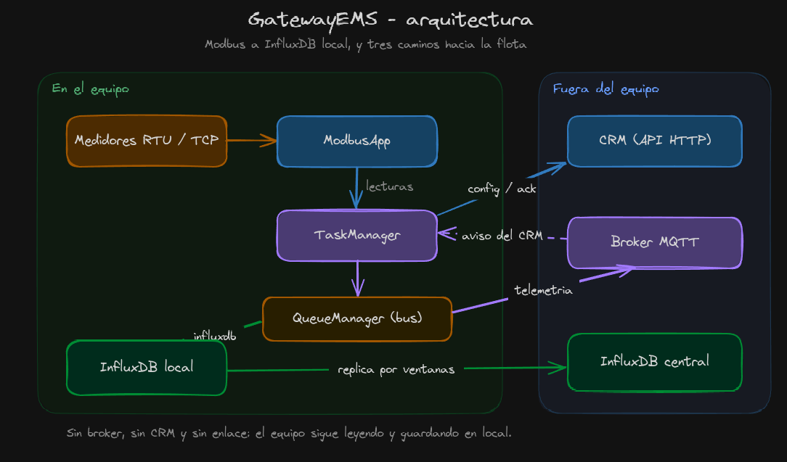
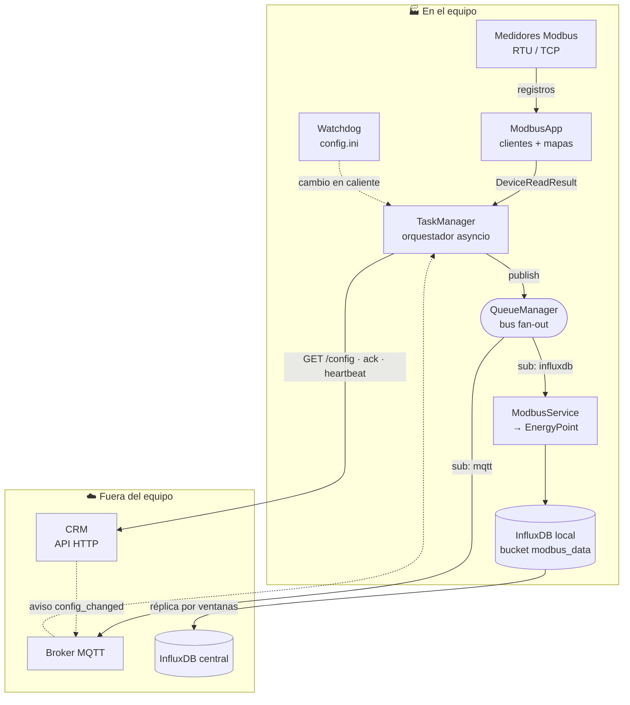
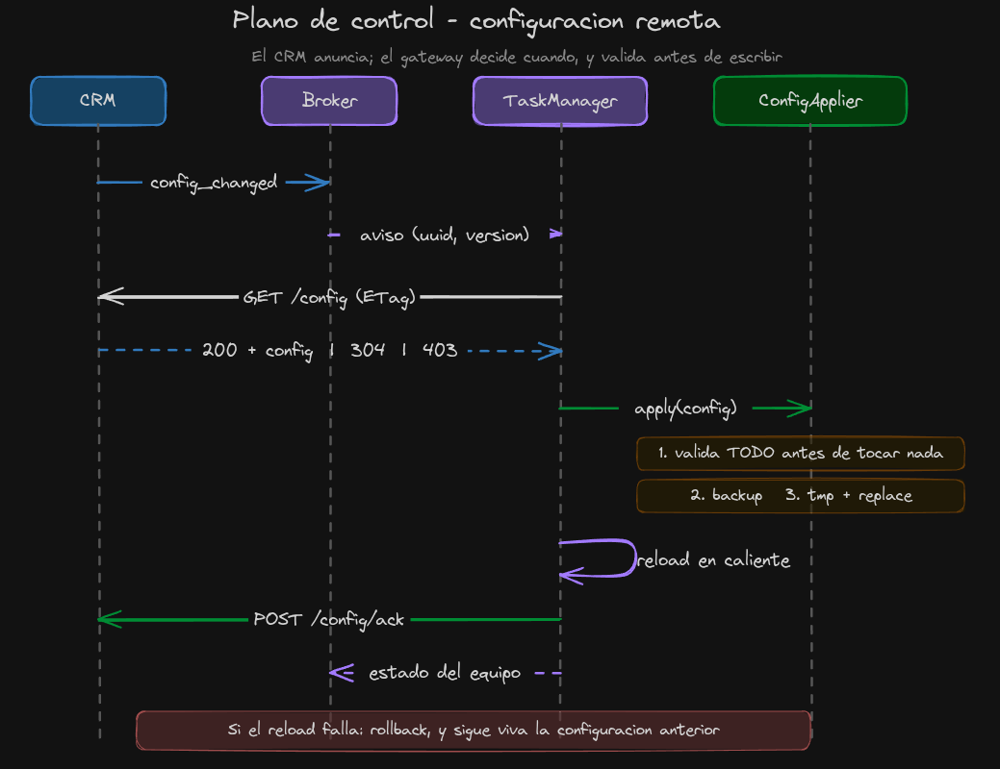
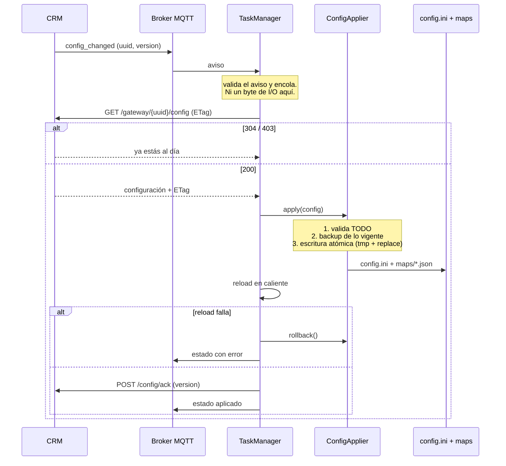

<div align="center">

# ⚡ GatewayEMS

### Gateway de energía: lee Modbus, guarda en InfluxDB, publica por MQTT y se configura solo desde el CRM

[](https://www.python.org/downloads/)
[](htmlcov/index.html)
[](tests/)
[](LICENSE)

[Qué hace](#qué-hace) •
[Instalación](#instalación) •
[Configuración](#configuración) •
[Plano de control](#plano-de-control-configuración-remota-desde-el-crm) •
[Réplica](#réplica-al-servidor-central) •
[Tests](#tests)

</div>

---

## Tabla de Contenidos

- [Qué hace](#qué-hace)
- [Arquitectura](#arquitectura)
- [Modos de operación](#modos-de-operación)
- [Requisitos](#requisitos)
- [Instalación](#instalación)
- [Variables de entorno](#variables-de-entorno)
- [Configuración](#configuración)
- [Plano de control](#plano-de-control-configuración-remota-desde-el-crm)
- [Réplica al servidor central](#réplica-al-servidor-central)
- [Los datos en InfluxDB](#los-datos-en-influxdb)
- [Estructura del proyecto](#estructura-del-proyecto)
- [Tests](#tests)
- [Troubleshooting](#troubleshooting)
- [Licencia](#licencia)

---

## Qué hace

GatewayEMS es el firmware que corre **dentro de un equipo en campo**. Lee
medidores de energía por Modbus RTU/TCP, guarda cada lectura en un InfluxDB que
vive en el propio equipo, y hace tres cosas más que sólo tienen sentido en una
flota:

| | |
|---|---|
| 📡 **Publica telemetría por MQTT** | Un topic por equipo, para que quien escuche se quede sólo con el suyo. |
| 🛰️ **Se configura desde el CRM** | El CRM avisa por MQTT, el gateway descarga por HTTP, valida, escribe y recarga **sin reiniciar**. |
| 🌐 **Replica al InfluxDB central** | Relee de su propio InfluxDB desde una marca de agua, así un corte de red de horas se recupera entero. |

Lo que **no** hace: depender de la red para seguir midiendo. Con el broker
caído, el CRM inalcanzable y el enlace cortado, el equipo sigue leyendo Modbus y
guardando en local. Todo lo demás es opcional y se apaga con un flag.

---

## Arquitectura

<div align="center">
  
</div>

> 🎨 [Abrir y editar en Excalidraw](https://excalidraw.com/#json=wEFW2zkKTyFcFISjghzMQ,ieb7IABlDh7vF9sBBUJw5g)
> · fuente en [`assets/arquitectura.excalidraw`](assets/arquitectura.excalidraw)

<details>
<summary>El mismo diagrama en mermaid</summary>


```mermaid
flowchart TB
    subgraph campo["🏭 En el equipo"]
        MB["Medidores Modbus<br/>RTU / TCP"]
        APP["ModbusApp<br/>clientes + mapas"]
        TM["TaskManager<br/>orquestador asyncio"]
        Q(["QueueManager<br/>bus fan-out"])
        SVC["ModbusService<br/>→ EnergyPoint"]
        IDB[("InfluxDB local<br/>bucket modbus_data")]
        WD["Watchdog<br/>config.ini"]
    end

    subgraph fuera["☁️ Fuera del equipo"]
        BR["Broker MQTT"]
        CRM["CRM<br/>API HTTP"]
        SRV[("InfluxDB central")]
    end

    MB -->|"registros"| APP
    APP -->|"DeviceReadResult"| TM
    TM -->|"publish"| Q
    Q -->|"sub: influxdb"| SVC --> IDB
    Q -->|"sub: mqtt"| BR
    WD -.->|"cambio en caliente"| TM
    CRM -.->|"aviso config_changed"| BR -.-> TM
    TM -->|"GET /config · ack · heartbeat"| CRM
    IDB -->|"réplica por ventanas"| SRV

    classDef ext fill:#eef,stroke:#88a
    class BR,CRM,SRV ext
```

</details>

**Las tareas que arranca `TaskManager`** (`src/Task/task.py`):

| Tarea | Qué hace | Condición |
|---|---|---|
| `read_modbus` | Lee los dispositivos habilitados cada `interval` segundos, dentro del horario activo | siempre |
| `process_queue` | Consume el bus y guarda el lote en InfluxDB local | siempre |
| `publish_mqtt` | Publica cada lectura en el topic del equipo | `MQTT_ACTIVE` |
| `listen_mqtt` | Escucha los avisos del CRM | `MQTT_ACTIVE` |
| `fetch_config` | Descarga la configuración cuando la anuncian | `MQTT_ACTIVE` |
| `apply_config` | Valida, escribe, recarga y confirma | `MQTT_ACTIVE` |
| `heartbeat` | Reporta presencia y pregunta si hay trabajo | `MQTT_ACTIVE` |
| `replicar_servidor` | Sube al InfluxDB central lo ya guardado | `INFLUXDB_SERVER_ACTIVE` |

La telemetría va por un **bus de fan-out**: cada sink (InfluxDB, MQTT) tiene su
propia cola y ve todos los lotes. El plano de control va por **colas de una
etapa** (`fetch_queue`, `apply_queue`), donde cada mensaje tiene un único
destinatario — son tuberías, no difusión.

---

## Modos de operación

Dos flags deciden cuánto del sistema se enciende. Ninguno afecta a la lectura
Modbus ni al guardado local:

| Modo | `MQTT_ACTIVE` | `INFLUXDB_SERVER_ACTIVE` | Resultado |
|---|---|---|---|
| **Autónomo** | `false` | `false` | Sólo Modbus → InfluxDB local. La configuración sale únicamente de `config.ini`. |
| **Conectado** | `true` | `false` | Además publica telemetría y acepta configuración remota del CRM. |
| **Flota completa** | `true` | `true` | Además sube sus lecturas al InfluxDB central. |
| **Aislado con réplica** | `false` | `true` | Sin broker ni CRM, pero sí sube al central (va por HTTP, no por MQTT). |

---

## Requisitos

- **Python** >= 3.12
- **InfluxDB 2.x** — incluido en `docker-compose.yml`
- **uv** — gestor de paquetes ([instalación](https://github.com/astral-sh/uv))
- Opcional: adaptador RS485 para Modbus RTU (p. ej. `/dev/ttyRS485`)

---

## Instalación

### 1. Dependencias

```bash
uv venv
source .venv/bin/activate
uv sync --all-extras
```

### 2. Variables de entorno

```bash
cp .env.example .env
nano .env          # broker, CRM, InfluxDB
```

### 3. Los tres valores que genera el propio equipo

`MQTT_CLIENT_ID`, `INFLUXDB_ADMIN_PASSWORD` e `INFLUXDB_TOKEN` no vienen del
CRM: los crea este equipo, al azar, y no salen de aquí. Una sola vez:

```bash
uv run python scripts/generate_device_env.py
```

No pisa una clave que ya tenga valor, así que volver a ejecutarlo es seguro.
`--dry-run` enseña qué haría; `--force` regenera — y eso cambia la identidad del
equipo frente al broker.

> ⚠️ `MQTT_CLIENT_ID` tiene que ser **único por equipo**. Dos gateways con el
> mismo se echan del broker mutuamente en bucle, y el síntoma que se ve no es un
> error de conexión: es telemetría que llega a saltos.

### 4. InfluxDB local

```bash
docker compose up -d
docker ps | grep influxdb
```

El contenedor se inicializa con las credenciales del `.env` (`DOCKER_INFLUXDB_INIT_*`),
así que el paso 3 va antes que este.

### 5. Dispositivos Modbus

Edita `src/Config/config.ini` ([ver abajo](#configuración)). Si el equipo está
conectado al CRM, este archivo lo escribe el CRM y no hace falta tocarlo.

### 6. Arrancar

```bash
python main.py
```

---

## Variables de entorno

Todas viven en `.env` y las valida `Settings` (`src/Core/config.py`) al arrancar:
si falta una obligatoria, el proceso no arranca y dice cuál.

### InfluxDB local

| Variable | Por defecto | Descripción |
|---|---|---|
| `INFLUXDB_URL` | — | `http://localhost:8086` en todos los equipos |
| `INFLUXDB_TOKEN` | — | 🔐 Lo genera el equipo |
| `INFLUXDB_ADMIN_USER` | — | Usuario administrador |
| `INFLUXDB_ADMIN_PASSWORD` | — | 🔐 La genera el equipo |
| `INFLUXDB_ORG` / `INFLUXDB_BUCKET` | — | Organización y bucket |
| `INFLUXDB_RETENTION` | — | Cuánto guarda antes de descartar (p. ej. `90d`) |

### MQTT

| Variable | Por defecto | Descripción |
|---|---|---|
| `MQTT_ACTIVE` | `true` | En `false`, modo autónomo: ni broker ni CRM |
| `MQTT_USE_TLS` | `false` | Contra un listener TLS **sin esto**, el CONNECT viaja en claro, el broker espera un ClientHello que no llega y los dos aguantan hasta el timeout: `timed out`, sin una pista de que el problema era el cifrado |
| `MQTT_HOST` / `MQTT_PORT` | — | Broker. `8883` exige TLS |
| `MQTT_USER` / `MQTT_PASSWORD` | — | Credenciales del broker |
| `MQTT_CLIENT_ID` | — | Único por equipo. Lo genera el equipo |
| `MQTT_TOPIC_TLM` | — | Base de los topics de telemetría |
| `MQTT_TOPIC_CRM` | — | Base del plano de control |
| `MQTT_QOS` | — | Calidad de servicio de las publicaciones |

### CRM

| Variable | Por defecto | Descripción |
|---|---|---|
| `CRM_API_URL` | — | URL de la API. `https` en producción |
| `GATEWAY_UUID` | — | Identidad del equipo en el CRM |
| `GATEWAY_CREDENTIAL` | — | 🔐 Credencial de larga vida; el CRM la enseña una sola vez |
| `CRM_HEARTBEAT_SECONDS` | `60` | Cada cuánto reporta presencia |
| `CRM_HTTP_TIMEOUT` | `30` | Timeout de las peticiones |

### InfluxDB central (opcional)

| Variable | Por defecto | Descripción |
|---|---|---|
| `INFLUXDB_SERVER_ACTIVE` | `false` | Enciende la réplica |
| `INFLUXDB_SERVER_URL` / `_TOKEN` / `_ORG` / `_BUCKET` | `""` | Obligatorias si la réplica está activa: `Settings` falla en el arranque nombrando la que falta, en vez de descubrirlo quince minutos después dentro de una traza de fondo |
| `INFLUXDB_SERVER_INTERVAL_MINUTES` | `15` | Cada cuánto sube |

---

## Configuración

El archivo es **`src/Config/config.ini`**. Los mapas de registros viven en
`src/Modbus/maps/*.json`.

### `[DEFAULT]` — logging

```ini
[DEFAULT]
loglevel = INFO
logstdout = True
logfile = src/Log/gateway_ems.log
max_size_bytes = 1485760
backup_count = 5
sampleslog = False
```

### `[MAINMODBUS]` — qué se lee y cuándo

```ini
[MAINMODBUS]
devicesnames = Modbus_DTSU666
interval = 5
start_hour = 0
stop_hour = 23
```

- `devicesnames`: lista separada por comas. **Cada nombre necesita su propia
  sección `[NOMBRE]`**; si no la tiene, el sistema lo ignora en silencio.
- `interval`: segundos entre lecturas.
- `start_hour` / `stop_hour`: fuera de ese rango no se lee nada.

### `[NOMBRE]` — un dispositivo

```ini
[Modbus_DTSU666]
identify_device = bf6a469f-4c2a-4402-9438-49a491ad2238
devicetype = CT_Meter
protocol = RTU
serialport = /dev/ttyRS485
baudrate = 9600
mapfile = src/Modbus/maps/Modbus_DTSU666.json
device_id = 11
modbusconnect = true
modbusread = true
```

Para Modbus TCP, cambia el transporte:

```ini
protocol = TCP
host = 192.168.1.100
port = 502
```

**`device_id` acepta varios esclavos** separados por comas — misma línea física,
mismo mapa, varias direcciones:

```ini
device_id = 11,12,13
```

Cada uno se lee por separado y se publica en su propio topic.

**`modbusconnect` y `modbusread`** son los dos interruptores que mira el
watchdog, y se pueden mover con el sistema en marcha:

| `modbusconnect` | `modbusread` | Qué pasa |
|---|---|---|
| `true` | `true` | Conecta y lee |
| `true` | `false` | Conecta y se queda ahí, sin leer |
| `false` | `true` | Combinación imposible: el sistema fuerza `modbusread = false` y avisa |
| `false` | `false` | Desconecta |

### Cambios en caliente

El watchdog revisa `config.ini` cada 2 segundos. Cambiar un interruptor,
agregar un dispositivo o mover el intervalo **no necesita reiniciar el
proceso**.

### Mapas Modbus

```json
{
  "VOLTAGE_A": { "address": "0x2006", "data_type": "f", "gain": "1" },
  "CURRENT_B": { "address": "8198",   "data_type": "f", "gain": "0.001" }
}
```

| Tipo | Código | Descripción |
|---|---|---|
| FLOAT | `f` | Punto flotante de 32 bits |
| INT16 | `h` | Entero de 16 bits con signo |
| UINT16 | `H` | Entero de 16 bits sin signo |
| INT32 | `i` | Entero de 32 bits con signo |
| UINT32 | `I` | Entero de 32 bits sin signo |

- **Direcciones**: hexadecimal con prefijo `0x`, o decimal sin él. El prefijo no
  es decorativo — sin él, un `0x2006` escrito como `2006` apunta a otro registro.
- **`gain`**: multiplica el valor leído. Por defecto `1`.
- **`function_code`**: `3` holding (por defecto), `4` input.

---

## Plano de control: configuración remota desde el CRM

El CRM no manda la configuración: **anuncia** que hay una nueva. El gateway la
descarga cuando puede, la valida y sólo entonces escribe.

<div align="center">
  
</div>

> 🎨 [Abrir y editar en Excalidraw](https://excalidraw.com/#json=aeQXUDUdJvlV9us3A6vL0,prgqfo0UUj04ml8fpu5Npg)
> · fuente en [`assets/plano-de-control.excalidraw`](assets/plano-de-control.excalidraw)

<details>
<summary>El mismo diagrama en mermaid</summary>


```mermaid
sequenceDiagram
    participant CRM
    participant BR as Broker MQTT
    participant GW as TaskManager
    participant AP as ConfigApplier
    participant FS as config.ini + maps

    CRM->>BR: config_changed (uuid, version)
    BR->>GW: aviso
    Note over GW: valida el aviso y encola.<br/>Ni un byte de I/O aquí.
    GW->>CRM: GET /gateway/{uuid}/config (ETag)
    alt 304 / 403
        CRM-->>GW: ya estás al día
    else 200
        CRM-->>GW: configuración + ETag
        GW->>AP: apply(config)
        Note over AP: 1. valida TODO<br/>2. backup de lo vigente<br/>3. escritura atómica (tmp + replace)
        AP->>FS: config.ini + maps/*.json
        GW->>GW: reload en caliente
        alt reload falla
            GW->>AP: rollback()
            GW->>BR: estado con error
        else
            GW->>CRM: POST /config/ack (version)
            GW->>BR: estado aplicado
        end
    end
```

</details>

**Endpoints que consume** (`src/Crm/client.py`):

| Método | Ruta | Para qué |
|---|---|---|
| `POST` | `/gateway/token` | Cambia la credencial de larga vida por un token corto |
| `POST` | `/gateway/{uuid}/heartbeat` | Reporta presencia y pregunta si hay trabajo |
| `GET` | `/gateway/{uuid}/config` | Descarga la configuración (con `ETag`) |
| `POST` | `/gateway/{uuid}/config/ack` | Confirma la versión aplicada |

**Cómo se leen las respuestas:**

- **`401`** — el token venció o revocaron la credencial. Se pide token nuevo y
  se reintenta **una** vez; si vuelve a fallar, la credencial ya no sirve y hace
  falta que el CRM emita otra.
- **`403`** — la descarga no está habilitada: el gateway ya está al día. No es
  un error.
- **`304`** — la versión que se tiene es la vigente. No se reescribe nada.

**Las tres reglas del applier** (`src/Crm/applier.py`):

1. **Validar antes de escribir.** Si algo no cuadra no se toca ni un archivo: un
   gateway con configuración vieja pero leyendo es mucho mejor que uno con
   configuración rota.
2. **Escritura atómica.** `tmp` + `os.replace`. Un corte de luz a mitad no puede
   dejar un `.ini` truncado.
3. **Backup y rollback.** Lo vigente se guarda antes de pisarlo. Si la recarga
   falla, se vuelve.

**El heartbeat es el camino que funciona con el broker caído.** El aviso MQTT
acelera; el heartbeat garantiza: cada `CRM_HEARTBEAT_SECONDS` el gateway
pregunta, y si el CRM dice que hay una versión distinta a la aplicada, entra por
la misma cola que el aviso.

El estado (versión aplicada, ETag) vive en `src/Config/remote/state.json`.

---

## Réplica al servidor central

Cada gateway sube sus lecturas al InfluxDB central con un tag `gateway_uuid`
añadido, que es lo que permite saber de qué equipo viene cada dato.

No acumula en memoria: **relee de su propio InfluxDB** desde una marca de agua
guardada en disco. El local ya es el almacén duradero, así que hace de buffer
gratis — un corte de red de horas se recupera entero cuando vuelve el enlace, y
un reinicio del proceso (rutina en un equipo de campo) no pierde nada.

Dos detalles que sostienen el diseño:

- **El borde derecho de la ventana se queda 30 s atrás.** Sin ese margen se
  leerían instantes que todavía se están escribiendo, y esa lectura parcial
  haría avanzar la marca por encima de lo que aún no había llegado.
- **Reenviar no duplica.** InfluxDB sobrescribe con el mismo measurement, tags y
  timestamp. Por eso, ante cualquier fallo, lo correcto es **no** mover la marca
  y repetir el tramo.

---

## Los datos en InfluxDB

Measurement: **`Modbus_Data`**. Cada variable del mapa es un field; el equipo y
el esclavo son tags.

```flux
from(bucket: "modbus_data")
  |> range(start: -1h)
  |> filter(fn: (r) => r._measurement == "Modbus_Data")
  |> filter(fn: (r) => r.device_id == "11")
```

La interfaz web queda en `http://localhost:8086`, con las credenciales del `.env`.

### Topics MQTT

| Topic | Contenido |
|---|---|
| `<MQTT_TOPIC_TLM>/<device_id>/<identify_device>` | Una lectura del equipo |
| `<MQTT_TOPIC_CRM>/<GATEWAY_UUID>/config` | Avisos del CRM hacia este gateway |
| `<MQTT_TOPIC_CRM>/<GATEWAY_UUID>/status` | Presencia y estado que publica el gateway |

Un topic por equipo para que quien escuche pueda quedarse sólo con el suyo.
Comodines útiles: `<base>/+/<uuid>` un equipo sea cual sea su esclavo,
`<base>/74/+` el esclavo 74, `<base>/#` todo.

---

## Estructura del proyecto

```
gatewayEMS/
├── 📂 src/
│   ├── 📂 Config/              # config.ini y su gestor
│   │   ├── config.py           # ConfigManager
│   │   ├── config.ini          # Configuración viva
│   │   └── 📂 remote/          # state.json y backups del CRM
│   ├── 📂 Core/                # Base del sistema
│   │   ├── config.py           # Settings (.env, Pydantic)
│   │   ├── device_secrets.py   # Los tres valores propios del equipo
│   │   └── watchdog.py         # Vigilancia de config.ini
│   ├── 📂 Crm/                 # Plano de control
│   │   ├── client.py           # Cliente HTTP del CRM
│   │   └── applier.py          # Config del CRM → config.ini + mapas
│   ├── 📂 Database/            # Persistencia
│   │   ├── connection.py       # Conexión a InfluxDB
│   │   ├── repository.py       # Escritura y consulta de puntos
│   │   ├── service.py          # ModbusService
│   │   └── replicator.py       # Réplica al servidor central
│   ├── 📂 Modbus/              # Comunicación Modbus
│   │   ├── app.py              # ModbusApp: clientes y lectura
│   │   ├── client.py           # Clientes RTU/TCP
│   │   ├── modbusmap.py        # Lectura de los mapas JSON
│   │   ├── read.py             # Decodificación de registros
│   │   └── 📂 maps/            # Mapas por dispositivo
│   ├── 📂 Models/              # Modelos de dominio
│   │   └── model.py            # EnergyPoint, DeviceReadResult, RemoteConfig
│   ├── 📂 Task/                # Orquestación
│   │   └── task.py             # TaskManager y sus tareas asyncio
│   └── 📂 Utils/               # Transversales
│       ├── logging.py          # Configuración del logger
│       └── utils.py            # QueueManager, MQTTManager
├── 📂 tests/                   # 392 tests, 90% de cobertura
│   ├── 📂 unit/ · integration/ · e2e/ · fixtures/
├── 📂 scripts/
│   └── generate_device_env.py  # Los valores propios del equipo, al instalar
├── 📄 main.py                  # Punto de entrada
├── 📄 .env / .env.example      # Entorno
├── 📄 docker-compose.yml       # InfluxDB local
└── 📄 pyproject.toml
```

---

## Tests

**392 tests, 90% de cobertura.** La suite no necesita `.env`, broker ni
InfluxDB: `tests/conftest.py` fija el entorno antes de importar `src`.

```bash
uv run pytest                      # todo, con cobertura
uv run pytest tests/unit -q        # sólo unitarios
uv run pytest -m integration       # por marcador
open htmlcov/index.html            # informe de cobertura
```

Cobertura por módulo (los que sostienen el comportamiento del equipo):

| Módulo | Cobertura |
|---|---|
| `Core/config.py` · `Core/device_secrets.py` · `Modbus/read.py` | 100% |
| `Models/model.py` | 99% |
| `Crm/applier.py` · `Modbus/modbusmap.py` | 97–98% |
| `Utils/utils.py` · `Crm/client.py` · `Database/repository.py` | 94–95% |
| `Database/replicator.py` | 91% |
| `Task/task.py` · `Modbus/client.py` | 85% |
| **Total** | **90%** |

---

## Troubleshooting

### La telemetría llega a saltos

Dos equipos con el mismo `MQTT_CLIENT_ID`. Se desconectan mutuamente en bucle y
el broker no lo reporta como error. Comprueba que cada equipo tenga el suyo:

```bash
uv run python scripts/generate_device_env.py --dry-run
```

### `timed out` al conectar con el broker

Casi siempre es `MQTT_USE_TLS=false` contra un listener TLS (puerto `8883`). El
gateway manda el CONNECT en claro, el broker espera un ClientHello, y los dos
aguantan hasta el timeout. Con certificado propio, además hay que instalar la CA
en el sistema (`update-ca-certificates`) y que `MQTT_HOST` coincida con el nombre
del certificado: si el certificado es para un nombre y conectas por IP, la
validación falla — con razón.

### `🔒 Credencial del gateway rechazada`

El CRM revocó `GATEWAY_CREDENTIAL` o nunca fue válida. No hay reintento que lo
arregle: hay que emitir una nueva desde la ficha del gateway en el CRM.

### `❌ Configuración rechazada, no se aplicó`

El applier validó y dijo que no. **No se escribió nada**: la configuración
anterior sigue viva y el equipo sigue leyendo. El log dice qué campo no cuadra,
y el gateway ya publicó el error en su topic de estado.

### El dispositivo Modbus no responde

1. Conexión física (RS485/Ethernet) y alimentación.
2. `baudrate` y `device_id` de la sección.
3. `tail -f src/Log/gateway_ems.log`.
4. Contrastar con una herramienta externa (`modpoll`, `qmodmaster`).

### InfluxDB no conecta

```bash
docker ps | grep influxdb
docker logs gateway_ems_influxdb
docker compose restart influxdb
```

Si el contenedor arrancó **antes** de generar `INFLUXDB_TOKEN`, quedó
inicializado con otro token: el volumen ya tiene los datos de setup y cambiar el
`.env` no lo modifica.

---

## Licencia

MIT. Ver [LICENSE](LICENSE).

---

<div align="center">

[⬆ Volver arriba](#-gatewayems)

</div>
