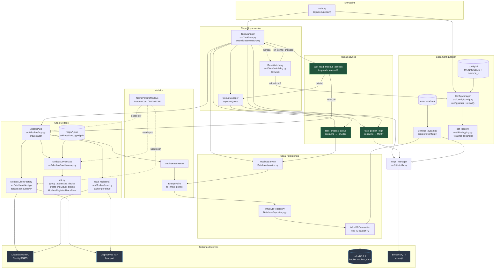
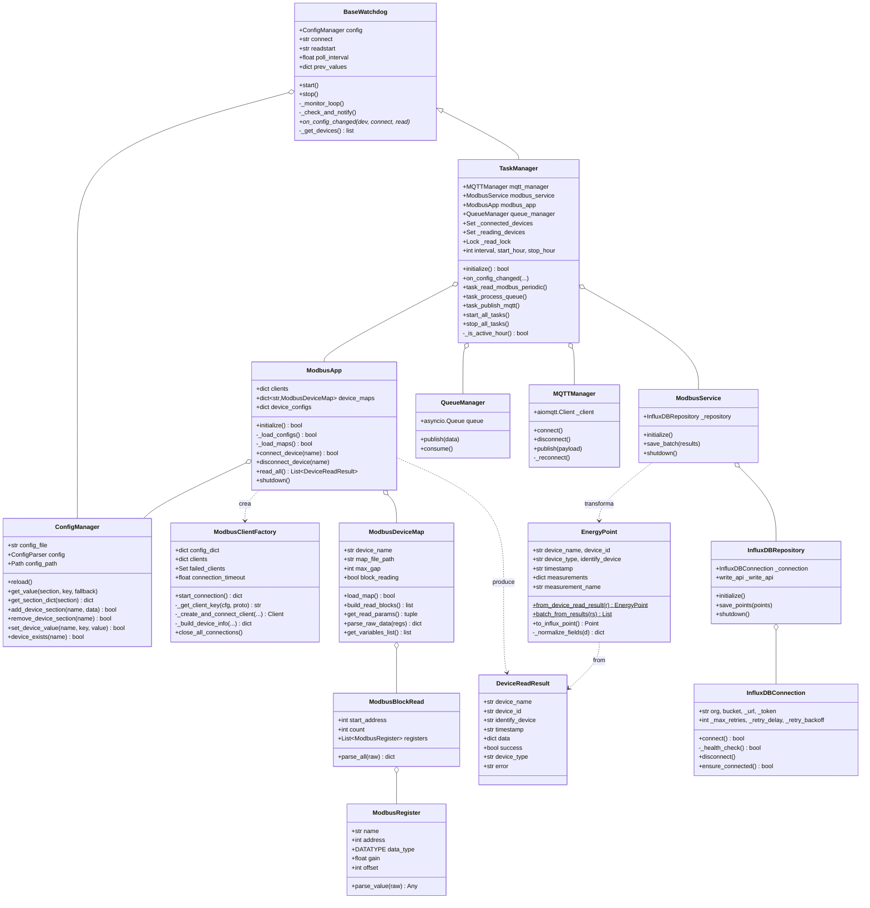
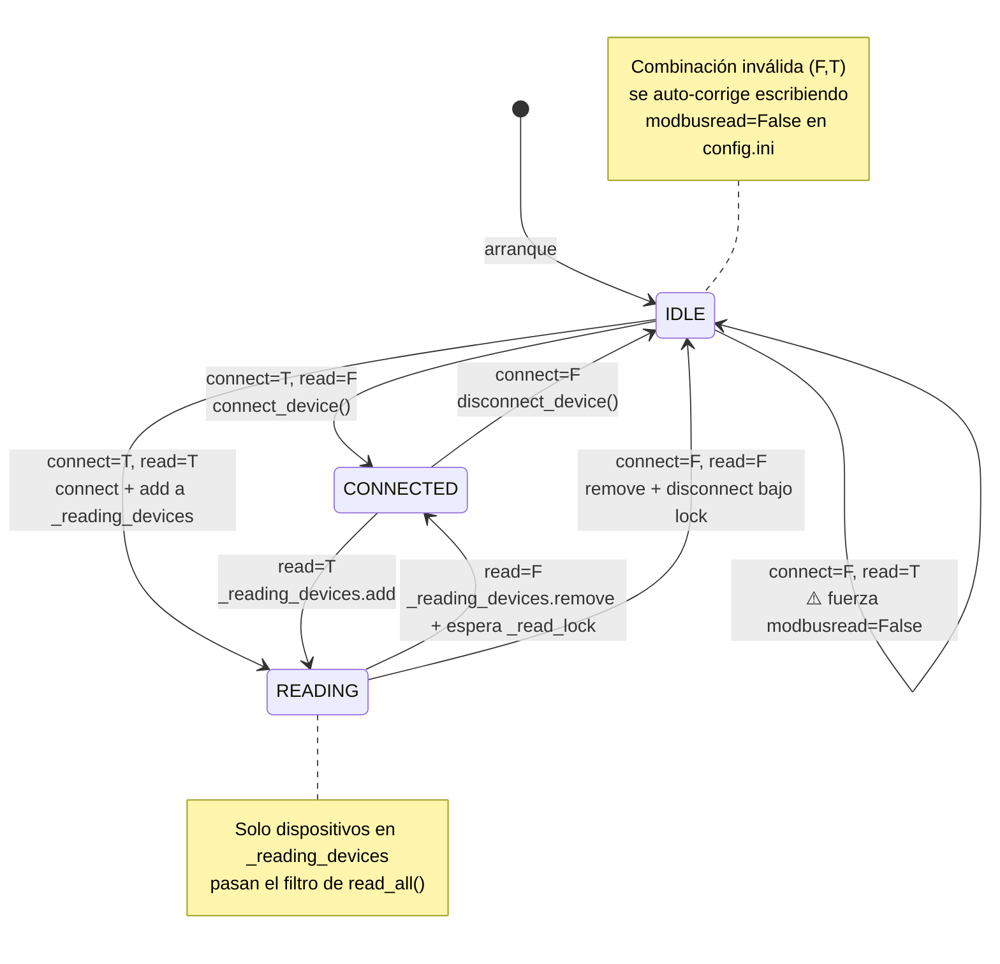
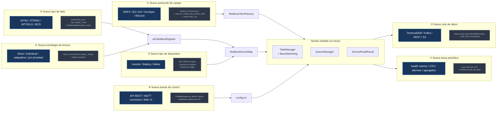
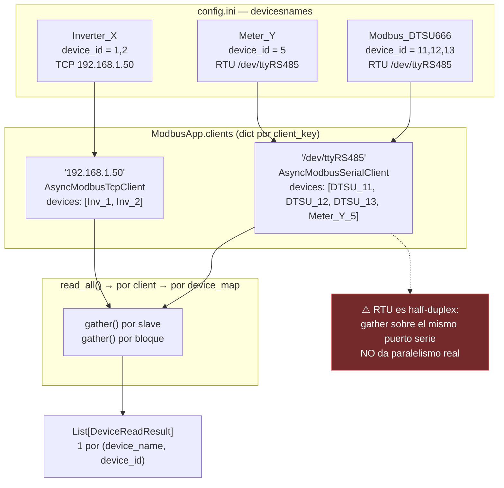
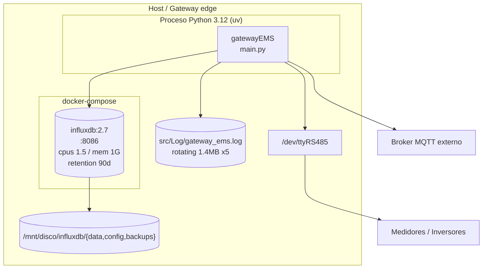
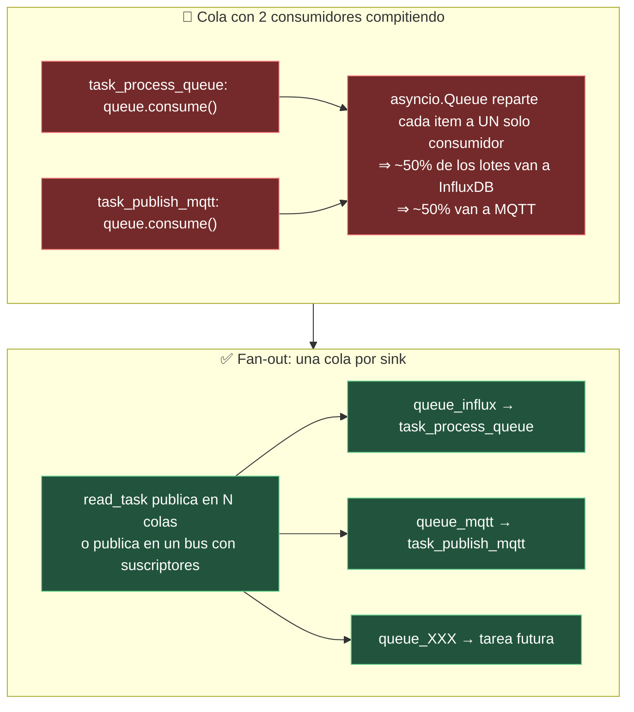
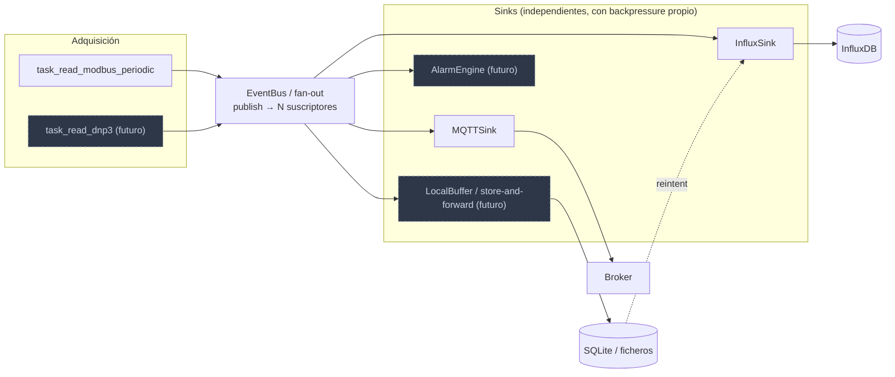

# Gateway EMS — Diagramas de Arquitectura y Escalabilidad

Generado a partir del análisis completo de `src/` (21 archivos, ~2.2k LOC).

---

## 1. Arquitectura completa (estado actual)

---

## 2. Diagrama de clases

---

## 3. Secuencia — ciclo de vida completo

```mermaid
sequenceDiagram
    autonumber
    participant M as main.py
    participant TM as TaskManager
    participant WD as BaseWatchdog
    participant CFG as config.ini
    participant APP as ModbusApp
    participant F as ClientFactory
    participant HW as Dispositivo Modbus
    participant Q as QueueManager
    participant SVC as ModbusService
    participant IDB as InfluxDB
    participant MQ as MQTT Broker

    M->>TM: TaskManager(ConfigManager())
    TM->>TM: __post_init__ (interval, horario)
    M->>TM: initialize()
    TM->>MQ: MQTTManager.connect()
    TM->>APP: ModbusApp(config)
    TM->>SVC: ModbusService.initialize()
    SVC->>IDB: connect() retry x3 backoff x2
    TM->>APP: _load_configs() + _load_maps()
    APP->>APP: ModbusDeviceMap.load_map()<br/>build_read_blocks()
    TM->>WD: start() → _check_and_notify + _monitor_loop

    rect rgb(30,50,70)
    note over WD,CFG: Activación por config (hot-reload cada 2s)
    WD->>CFG: reload() + getboolean(modbusconnect/modbusread)
    CFG-->>WD: (True, True) ≠ prev
    WD->>TM: on_config_changed(dev, True, True)
    TM->>APP: connect_device(dev)
    APP->>F: start_connection(factory_config)
    F->>HW: AsyncModbusSerial/Tcp connect()
    HW-->>F: connected
    F-->>APP: {client_key: {client, devices[]}}
    TM->>TM: _connected_devices.add + _reading_devices.add
    end

    M->>TM: start_all_tasks()

    loop cada interval/2 s, si _is_active_hour()
        TM->>APP: read_all()
        APP->>HW: read_registers(slaves, addrs, counts)
        HW-->>APP: registros crudos
        APP->>APP: parse_raw_data → DeviceReadResult[]
        APP-->>TM: results
        TM->>Q: publish({results, success_count, total_count})
    end

    par Consumidor A
        Q-->>TM: consume() → task_process_queue
        TM->>SVC: save_batch(results)
        SVC->>SVC: EnergyPoint.batch_from_results<br/>to_influx_point()
        SVC->>IDB: write(points)
    and Consumidor B
        Q-->>TM: consume() → task_publish_mqtt
        TM->>MQ: publish(result) por cada lectura
    end

    M->>TM: stop_all_tasks()
    TM->>WD: stop()
    TM->>SVC: shutdown()
    TM->>APP: shutdown() → cierra clientes
```

---

## 4. Máquina de estados por dispositivo (watchdog)

Controlada por `modbusconnect` / `modbusread` en `config.ini`.

---

## 5. Puntos de extensión — cómo escala con nuevas funciones

### Coste de cada extensión

| # | Extensión | Archivos a tocar | Código nuevo |
|---|-----------|------------------|--------------|
| ② | Nuevo dispositivo del mismo protocolo | `maps/*.json`, `config.ini` | **0 LOC** |
| ⑤ | Estrategia de lectura | `Modbus/util.py`, `modbusmap.py` | ~40 LOC |
| ④ | Tipo de dato | `Models/model.py`, `Modbus/util.py` | ~15 LOC |
| ⑦ | Tarea periódica | `Task/task.py` | ~30 LOC |
| ③ | Sink de datos | `Database/` (nuevo repo+service) | ~120 LOC |
| ⑥ | Fuente de control externa | módulo nuevo + `Config/config.py` | ~150 LOC |
| ① | Protocolo de campo | `Modbus/client.py`, `read.py`, `model.py` | ~250 LOC |

---

## 6. Escalabilidad de conexiones (agrupación por bus)

`ModbusClientFactory` agrupa por `serialport` (RTU) o `host` (TCP). N dispositivos con el mismo bus ⇒ 1 cliente.

---

## 7. Despliegue

---

## 8. Hallazgos que limitan el escalado

Detectados durante el análisis del código. Ordenados por impacto.

| Severidad | Ubicación | Problema | Efecto al escalar |
|-----------|-----------|----------|-------------------|
| 🔴 Alta | `Task/task.py:263,299` | Dos tareas consumen la **misma** `asyncio.Queue` | Cada lote llega a un solo sink. Añadir un 3er sink empeora el reparto (1/3 cada uno). |
| 🔴 Alta | `Utils/utils.py` `MQTTManager.publish` | `await self._client.publish(...)` está **dentro** del `if not isinstance(payload, str)` | Si el payload ya es `str` no se publica nada, en silencio. |
| 🟠 Media | `Utils/utils.py` `MQTTManager.publish` | Rama de reconexión usa `self.settings.qos` — atributo inexistente | `AttributeError` justo en el camino de recuperación. |
| 🟠 Media | `Modbus/app.py:193-194` | `device_name.split('_')` toma sólo `part[0]_part[1]` | Rompe con nombres tipo `Modbus_DTSU_666`. Limita la convención de nombres. |
| 🟠 Media | `Task/task.py:201` | `_read_lock` cubre **todos** los dispositivos | Un bus TCP lento bloquea la lectura de los demás buses. |
| 🟡 Baja | `Modbus/read.py` | `gather` por slave sobre un mismo puerto RTU | Sin paralelismo real en serie; el tiempo crece lineal con nº de esclavos. |
| 🟡 Baja | `Database/connection.py` | `write_api` es `SYNCHRONOUS` dentro de código async | Bloquea el event loop en cada escritura de lote. |
| 🟡 Baja | `Task/task.py:247` | `sleep(self.interval/2)` | El intervalo efectivo es la mitad del configurado. |
| 🟡 Baja | `Task/task.py:141` | `initialize()` llama `_load_configs` tras crear `ModbusService` | Un fallo de InfluxDB aborta todo el arranque pese al log "continuará sin InfluxDB". |
| 🟡 Baja | `Core/watchdog.py` | Polling de `config.ini` cada 2s | Dependencia `watchdog>=6.0.0` está en `pyproject.toml` pero no se usa (inotify daría 0 polling). |

---

## 9. Arquitectura objetivo sugerida (post-fixes)

